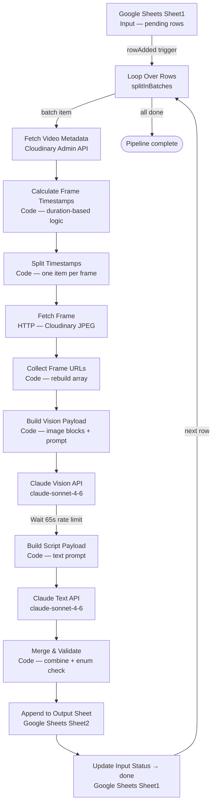

# GoodScore — Ad Variable Extraction Pipeline

> End-to-end n8n pipeline that samples video frames from Cloudinary, sends them to Claude Vision, passes the script to Claude Text, and writes 10 structured creative performance variables back to Google Sheets — fully automated.


---

## Problem Statement

GoodScore's performance marketing team runs video ads targeting Tier-2 and Tier-3 users across platforms in India. Evaluating creative performance requires understanding *why* a particular ad worked — what hook style was used, whether a face appeared in the first frames, what emotional tone the script carried, and whether a clear CTA was present.

Manually tagging these attributes across dozens of ads is slow, inconsistent, and doesn't scale. This pipeline automates the entire analysis: from raw video in Cloudinary to a structured, analyst-ready output row in Google Sheets — triggered the moment a new ad is added.

---

## Solution Overview

The pipeline automatically processes each ad through four stages:

1. **Trigger** — A new row is added to the input sheet (`Sheet1`) with an ad's `video_url` (Cloudinary public ID) and `script` text. The Google Sheets trigger fires immediately.
2. **Sample** — The Cloudinary Admin API fetches the video duration. A duration-aware algorithm calculates up to 12 frame timestamps. Each frame is fetched as a JPEG from Cloudinary using `so_` (start-offset) transformations.
3. **Analyse** — All frames are sent to Claude Sonnet (`claude-sonnet-4-6`) via the Vision API to extract 5 visual variables. The script is sent to Claude Text API to extract 5 script variables. The two calls run sequentially (with a 65-second rate-limit wait between them).
4. **Write** — A Code node merges and validates both JSON outputs against allowed enum values, appends the result row to `Sheet2`, and updates the input row's status to `done`.

---

## Architecture Diagram



---

## Node Breakdown

| # | Node | Type | Purpose |
|---|------|------|---------|
| 01 | Read Pending Rows | Google Sheets Trigger | Fires on every new row added to Sheet1 |
| 02 | Loop Over Rows | splitInBatches | Processes one ad at a time; loops back after each row completes |
| 03 | Fetch Video Metadata | HTTP Request | Calls Cloudinary Admin API to get video duration |
| 04 | Calculate Frame Timestamps | Code (JS) | Duration-aware algorithm: produces up to 12 sample timestamps |
| 05 | Split Timestamps | Code (JS) | Expands the timestamps array into one n8n item per frame |
| 06 | Fetch Frame | HTTP Request | Downloads each frame as a JPEG binary from Cloudinary (`so_` offset) |
| 07 | Collect Frame URLs | Code (JS) | Re-assembles all frame URLs into a single item for Claude |
| 08 | Build Vision Payload | Code (JS) | Builds Claude API request: image content blocks + vision prompt |
| 09 | Claude Vision API | HTTP Request | Sends frames to `claude-sonnet-4-6`, receives 5 visual variables |
| 10 | Wait 65s (Rate Limit) | Wait | Respects Anthropic's per-minute token rate limit between calls |
| 11 | Build Script Payload | Code (JS) | Builds Claude API request: script text + extraction prompt |
| 12 | Claude Text API | HTTP Request | Sends script to `claude-sonnet-4-6`, receives 5 script variables |
| 13 | Merge & Validate | Code (JS) | Merges both JSON outputs, validates against allowed enum values |
| 14 | Append to Output Sheet | Google Sheets | Appends the 10-variable result row to Sheet2 |
| 15 | Update Input Status | Google Sheets | Updates the processed row in Sheet1: `status → done` (or `error`) |

---

## Variables Extracted

### Visual (from video frames via Claude Vision)

| # | Variable | Type | Allowed Values |
|---|----------|------|----------------|
| 1 | `hook_type` | enum | `question` \| `bold_statement` \| `person_speaking` \| `text_only` \| `visual_shock` |
| 2 | `face_in_hook` | boolean | `true` \| `false` |
| 3 | `eye_contact_in_hook` | boolean | `true` \| `false` |
| 4 | `scene_setup` | enum | `person_to_cam` \| `skit` \| `skit_p2c` \| `b_roll` \| `b_roll_long` |
| 5 | `subtitle_present` | boolean | `true` \| `false` |

> `hook_type`, `face_in_hook`, and `eye_contact_in_hook` are evaluated from the **first two frames only**. `scene_setup` is evaluated across all frames.

### Script (from ad script text via Claude Text)

| # | Variable | Type | Allowed Values |
|---|----------|------|----------------|
| 6 | `emotional_tone` | enum | `urgency` \| `aspiration` \| `humor` \| `trust` \| `empathy` \| `fear` |
| 7 | `hook_addresses_pain` | boolean | `true` \| `false` |
| 8 | `cta_type` | enum | `check_score_free` \| `check_score` \| `download_app` \| `call_now` \| `visit_website` \| `none` |
| 9 | `social_proof_present` | boolean | `true` \| `false` |
| 10 | `language_primary` | enum | `hindi` \| `english` \| `hinglish` |

The Merge & Validate node checks every extracted value against its allowed list and flags any unexpected value in `error_detail` rather than silently passing bad data.

---

## Frame Sampling Logic

The number and placement of frames extracted per video scales with duration, capped at **12 frames max**.

| Duration | Interval | Anchor Frames | Middle Frames |
|----------|----------|---------------|---------------|
| < 8s | — | `[0, floor(d/2), d-1]` | None (3 frames only) |
| 8–15s | Every 3s | `0, 3, d-1` | `5s → d-2s` step 3 |
| 15–30s | Every 5s | `0, 3, d-1` | `5s → d-2s` step 5 |
| 30–60s | Every 7s | `0, 3, d-1` | `5s → d-2s` step 7 |
| 60s+ | Every 10s | `0, 3, d-1` | `5s → d-2s` step 10 |

Anchors (`0s`, `3s`, `duration-1s`) are always included regardless of duration. Timestamps are deduplicated and sorted before capping. The last anchor (`d-1`) is always preserved when capping at 12.

Frame URLs are constructed using Cloudinary's `so_` (start-offset) video transformation:
```
https://res.cloudinary.com/{cloud_name}/video/upload/so_{timestamp}/{public_id}.jpg
```

---

## Setup Guide

### Prerequisites

- [n8n](https://n8n.io) instance (self-hosted or cloud) — v1.0+
- Cloudinary account with video assets uploaded
- Google Cloud project with Sheets API enabled
- Anthropic API key with access to `claude-sonnet-4-6`

### Credentials Required

Create the following credentials in your n8n instance before importing the workflow:

| Credential Name | Type | Used By |
|----------------|------|---------|
| `google-sheets-trigger-oauth` | Google Sheets Trigger OAuth2 | Read Pending Rows (trigger) |
| `google-sheets-oauth` | Google Sheets OAuth2 | Append to Output Sheet, Update Input Status |

Cloudinary and Anthropic credentials are passed as HTTP headers directly in the workflow — update them in the HTTP Request nodes after import.

### Step 1 — Google Sheets Setup

Create a Google Sheet with two tabs:

**Sheet1 — Input**

| Column | Description |
|--------|-------------|
| `ad_id` | Unique identifier for the ad (e.g. `ad_001`) |
| `video_url` | Cloudinary **public ID only** — not a full URL (e.g. `goodscore/ads/ad_001`) |
| `script` | Full ad script text (Hindi, English, or Hinglish) |
| `success` | Optional performance label (e.g. win / loss) |
| `status` | Set to `pending` for rows to be processed |

**Sheet2 — Output**

Headers: `ad_id`, `duration_seconds`, `frame_count`, `processed_at`, `hook_type`, `face_in_hook`, `eye_contact_in_hook`, `scene_setup`, `subtitle_present`, `emotional_tone`, `hook_addresses_pain`, `cta_type`, `social_proof_present`, `language_primary`, `status`, `error_detail`

Note your Sheet ID from the URL: `https://docs.google.com/spreadsheets/d/YOUR_SHEET_ID/edit`

### Step 2 — Import the Workflow

In n8n: **Workflows → Import from file**, select `workflows/goodscore_ad_variable_extraction.json`.

### Step 3 — Configure Placeholders

After importing, update the following in the workflow:

**Fetch Video Metadata node (HTTP Request):**
- URL: replace `YOUR_CLOUDINARY_CLOUD_NAME` with your Cloudinary cloud name
- Authorization header: replace `YOUR_CLOUDINARY_KEY_SECRET_BASE64` with your `key:secret` pair encoded in Base64

**Split Timestamps node (Code):**
- Replace `YOUR_CLOUDINARY_CLOUD_NAME` in the `frame_url` template string

**Build Vision Payload + Build Script Payload nodes (Code):**
- No changes needed (prompts are self-contained)

**Claude Vision API + Claude Text API nodes (HTTP Request):**
- `x-api-key` header: replace `YOUR_ANTHROPIC_API_KEY` with your Anthropic API key

**Read Pending Rows (trigger) + Append to Output Sheet + Update Input Status nodes:**
- Set the Document ID to your Google Sheet ID
- Set the Sheet Name to `Sheet1` (trigger) and `Sheet2` (write nodes)

### Step 4 — Activate

Activate the workflow. It will trigger automatically whenever a new row with `status = pending` is added to Sheet1.

---

## Output Schema

Each processed ad produces one row in Sheet2:

| Column | Type | Description |
|--------|------|-------------|
| `ad_id` | string | Matched from input row |
| `duration_seconds` | number | Video duration from Cloudinary metadata |
| `frame_count` | number | Number of frames sampled (3–12) |
| `processed_at` | ISO timestamp | UTC time the row was written |
| `hook_type` | enum | Hook format classified from first two frames |
| `face_in_hook` | boolean | Whether a face is visible in the opening frames |
| `eye_contact_in_hook` | boolean | Whether the subject makes eye contact with camera |
| `scene_setup` | enum | Overall visual style of the ad |
| `subtitle_present` | boolean | Whether subtitles/captions are visible |
| `emotional_tone` | enum | Dominant emotional tone of the script |
| `hook_addresses_pain` | boolean | Whether the hook targets a specific user problem |
| `cta_type` | enum | Type of call-to-action in the script |
| `social_proof_present` | boolean | Whether the script references testimonials or proof |
| `language_primary` | enum | Primary language of the script |
| `status` | string | `done` on success, `error` on validation failure |
| `error_detail` | string | Pipe-separated list of validation errors (empty if clean) |

---

## Tech Stack

| Component | Technology |
|-----------|------------|
| Automation runtime | [n8n](https://n8n.io) |
| Vision analysis | Anthropic Claude Sonnet 4.6 (`claude-sonnet-4-6`) |
| Script analysis | Anthropic Claude Sonnet 4.6 (`claude-sonnet-4-6`) |
| Video storage | Cloudinary |
| Input / Output | Google Sheets |

---

## Repository Structure

```
goodscore-ad-variable-extraction/
├── README.md                                       ← This file
├── .gitignore
├── workflows/
│   └── goodscore_ad_variable_extraction.json       ← n8n workflow (import this)
└── scripts/
    └── frame_timestamps.js                         ← Standalone frame timestamp calculator + self-test
```

---

## License

MIT License. See [LICENSE](LICENSE) for details.
